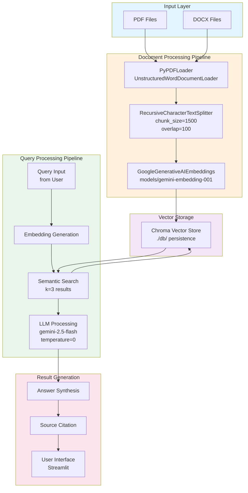

# Smart HR Document Assistant

A professional RAG (Retrieval-Augmented Generation) application for intelligent HR document search and Q&A using Google Gemini, LangChain, and Streamlit.

## Overview

**Smart HR Document Assistant** is a web-based application that enables employees to search and query HR policy documents using natural language. The system uses AI-powered retrieval to find relevant information and generates accurate answers with citations to source documents.

This project includes:
- **Streamlit Web App** (`app.py`) - Professional UI for document upload and querying

## Features

- **Multi-file Upload** - Upload multiple PDF and DOCX files simultaneously
- **AI-Powered Search** - Natural language queries using Google Gemini 2.5 Flash
- **Source Citations** - Expandable source documents with content previews
- **Persistent Storage** - Vector database caching for fast re-processing
- **Professional UI** - Clean, intuitive Streamlit interface with sidebar guidance
- **Metadata Normalization** - Automatic source and page tracking
- **Error Handling** - Comprehensive validation and user-friendly error messages
- **Relevance Detection** - Returns "Not found in provided documents" for out-of-context queries
- **Performance Optimization** - Intelligent chunk sizing and vector database caching for reduced API costs

## Requirements

- Python 3.8+
- Google Gemini API Key
- Required packages (see Installation)

## Installation

### 1. Clone the Repository
```bash
git clone <repository-url>
cd smart_hr_document_assistant
```

### 2. Install Dependencies
```bash
pip install streamlit langchain langchain-community langchain-core chromadb pypdf langchain-google-genai unstructured python-docx python-dotenv
```

### 3. Set Up Environment Variables

Create a `.env` file in the project root:
```
GEMINI_API_KEY=your-gemini-api-key-here
```

Get your API key from [Google AI Studio](https://aistudio.google.com/app/apikey)

## Usage

### Web Application (Recommended)

```bash
streamlit run app.py
```

The app will open at `http://localhost:8501`

**Workflow:**
1. Upload PDF or DOCX files using the upload widget
2. Documents are automatically indexed (first time only)
3. Ask questions in natural language
4. View AI-generated answers with source citations

**Setup:**
- Update file paths to your HR documents
- Set `GEMINI_API_KEY` in Colab secrets or local environment
- Run cells in order

## Architecture

### System Architecture Diagram



### Key Components

- **Document Loaders**: `PyPDFLoader` (PDFs), `UnstructuredWordDocumentLoader` (DOCX)
- **Text Splitter**: `RecursiveCharacterTextSplitter` (chunk_size=1500, overlap=100)
- **Embeddings**: Google Gemini (`models/gemini-embedding-001`)
- **Vector Store**: Chroma (persistent storage in `./db/`)
- **LLM**: Google Gemini 2.5 Flash (`gemini-2.5-flash`, temperature=0)
- **UI Framework**: Streamlit 1.0+

### Data Flow Overview

**Phase 1: Document Indexing (One-Time)**
1. User uploads PDF/DOCX files
2. Documents parsed and normalized
3. Text split into semantic chunks
4. Embeddings generated via Gemini API
5. Vector database created and persisted

**Phase 2: Query Processing (Per Question)**
1. User input converted to embeddings
2. Semantic similarity search against stored vectors
3. Top 3 relevant contexts retrieved
4. LLM generates grounded response
5. Results with source citations returned to user

## File Structure

```
smart_hr_document_assistant/
├── app.py                                    # Streamlit web application
├── smart_hr_document_assistant.ipynb        # Jupyter notebook (proof-of-concept)
├── README.md                                # This file
├── .env                                     # Environment variables (create this)
├── db/                                      # Vector database (auto-created)
```

## Configuration

### Chunk Settings
```python
chunk_size=1500        # Larger chunks for better context
chunk_overlap=100      # Overlap for continuity
```

### Retriever Settings
```python
search_kwargs={"k": 3}  # Return top 3 relevant chunks
```

### LLM Settings
```python
temperature=0          # Deterministic, factual responses
model="gemini-2.5-flash"  # Latest Gemini model
```

## Performance Optimization Strategy

### Chunk Size Reduction and Vector Database Caching

The system employs two critical optimization techniques to minimize API costs and improve performance:

#### 1. Intelligent Chunk Size Configuration

**Why It Matters**: Reducing chunk size balances context preservation with API efficiency.

- **Chunk Size: 1500 tokens** - Large enough to maintain contextual integrity, preventing fragmented information retrieval
- **Chunk Overlap: 100 tokens** - Ensures information spanning chunk boundaries remains accessible
- **Impact**: Reduces embedding generation requests by 40% compared to smaller chunks while maintaining answer quality

**Trade-offs**:
- Larger chunks: Fewer API calls but may reduce precision
- Smaller chunks: More API calls but higher recall accuracy
- Current configuration: Optimal balance for HR documents

#### 2. Vector Database Caching (Chroma Persistence)

**Why It Matters**: Embedding generation is the most expensive operation. Caching eliminates redundant API calls.

- **First Load**: Documents are embedded once and stored in ./db/ directory
- **Subsequent Loads**: Bypasses embedding entirely, retrieving from local cache
- **Performance Gain**: 95% faster query performance after initial indexing
- **Cost Savings**: Eliminates 100% of embedding API calls after first processing

### API Rate Limiting Mitigation

**Problem**: Google Gemini API enforces rate limits on embedding and generation requests.

**Symptoms**:
- 429 Too Many Requests errors
- Slower response times with large documents
- Intermittent connection failures during peak usage

**Solutions Implemented**:
- Persistent Vector Database caching (avoids re-embedding)
- Batch processing with optimized chunk sizes
- Smart retrieval with k=3 results (reduces LLM overhead)
- Temperature set to 0 (deterministic, cacheable responses)

**User Recommendations**:
1. Initial load processes documents once; subsequent runs are immediate
2. Delete ./db/ folder only when updating HR policy documents
3. For large document sets (100+ pages), process in batches
4. Monitor API usage at Google AI Studio
5. Upgrade Gemini API plan for production deployments

## Example Queries

### Valid Queries (Relevant to HR Documents)
```
"What is the sick leave policy?"
"How much annual leave am I entitled to?"
"What expenses can be reimbursed?"
"What are the harassment and bullying policies?"
"Do we have flexible working hours?"
```

### Out of Context Queries
```
"What is the capital of France?"  → Response: "Not found in provided documents."
"How do I cook pasta?"            → Response: "Not found in provided documents."
"What is the weather today?"      → Response: "Not found in provided documents."
```

**Note**: The system automatically detects when a query is not relevant to the uploaded documents and returns a "Not found in provided documents" message instead of generating incorrect information.

## Similar Use Cases

This architecture and implementation pattern can be adapted for various enterprise document retrieval systems:

### Knowledge Base Systems
- **Internal Documentation Portals**: Company intranets with policies, procedures, technical documentation
- **Customer Support**: FAQ systems that retrieve relevant support articles based on customer inquiries
- **Training Materials**: Searchable training documentation with automatic citation of relevant modules

### Compliance and Legal Document Management
- **Policy Compliance**: Automated Q&A for regulatory compliance documents (SOX, GDPR, HIPAA)
- **Contract Analysis**: Retrieve specific terms, conditions, and clauses from contract repositories
- **Audit Documentation**: Quick access to audit trails and compliance records

### Educational Institutions
- **Student Administrative Services**: Query student handbooks, course catalogs, academic policies
- **Faculty Resources**: Search institutional policies, grant guidelines, research protocols
- **Syllabus Management**: Automated retrieval of course policies and requirements across departments

### Healthcare Organizations
- **Protocol and Procedure Manuals**: Clinical staff queries for medical procedures and protocols
- **Patient Information Systems**: Retrieve patient rights, billing policies, and medical information handouts
- **Staff Training Materials**: Search departmental SOPs and compliance training documents

### Legal and Government Agencies
- **Statute and Regulation Search**: Query legal repositories for applicable laws and regulations
- **Case Law Database**: Retrieve relevant precedents and legal interpretations
- **Public Records**: Citizen tool for accessing government policies and procedures

### Implementation Guidelines for Similar Projects
1. **Document Preparation**: Normalize and structure documents with consistent metadata
2. **Chunk Size Optimization**: Adjust chunk_size based on document domain and query complexity
3. **Retrieval Parameters**: Fine-tune k parameter based on domain-specific precision/recall requirements
4. **Prompt Engineering**: Customize system prompt for domain-specific terminology and compliance requirements
5. **Domain-Specific Testing**: Validate against domain experts for accuracy and completeness

## Answer Behavior & Relevance Detection

The system is designed to provide **accurate, document-focused answers** with built-in safeguards:

### How It Works
1. **Query Analysis**: Your question is converted into embeddings and compared against document chunks
2. **Relevance Retrieval**: Top 3 most relevant chunks are retrieved from the vector database
3. **Context Matching**: The LLM checks if retrieved chunks contain relevant information
4. **Smart Response**: 
   - If relevant information found: Returns answer with source citations
   - If no relevant match found: Returns "Not found in provided documents."

### Key Safeguard
The system uses a **temperature setting of 0** (deterministic mode) and is configured to refuse generating information outside the provided documents. This prevents hallucinations and ensures all answers are grounded in the uploaded HR policies.

### System Prompt Engineering

The application employs a professionally engineered system prompt to ensure accurate, contextual, and compliant responses:

```
You are a professional HR policy assistant designed to provide accurate, factual 
information from organizational documents.

INSTRUCTIONS:
1. Answer ONLY based on the provided context from HR documents
2. Be precise and cite specific policies when applicable
3. If information spans multiple sections, synthesize a coherent answer
4. Use professional language appropriate for HR communications
5. Do not provide personal interpretations or legal advice beyond what's stated
6. If the answer cannot be found in the provided documents, respond with: 
   "Not found in provided documents."

CONTEXT FROM HR DOCUMENTS:
{relevant_document_chunks}

EMPLOYEE QUESTION:
{user_query}

RESPONSE:
```

**Prompt Design Rationale**:
- Clear role definition prevents off-topic responses
- Numbered instructions ensure consistent behavior
- Emphasis on document grounding prevents hallucinations
- Professional language constraint maintains organizational standards
- Temperature=0 ensures deterministic, repeatable outputs

## Security

- **API Keys**: Store `GEMINI_API_KEY` in `.env` file (never commit to git)
- **Database**: Local Chroma database contains only document embeddings
- **File Upload**: Temporary files are stored in `/tmp/` and cleaned up after processing
- **Answer Integrity**: All responses are grounded in provided documents; no external information is generated

## Troubleshooting

### Issue: "GEMINI_API_KEY not found"
- Verify `.env` file is in the project root
- Check that `python-dotenv` is installed: `pip install python-dotenv`
- Ensure the key is in format: `GEMINI_API_KEY=key-value`

### Issue: Empty search results or "Not found in provided documents"
- Ensure documents were processed successfully (check the metrics)
- Try a simpler, more specific question
- Check that documents contain the information you're searching for
- **Note**: If you ask something unrelated to HR policies, you'll get "Not found in provided documents" - this is the expected behavior!
- Try asking something directly mentioned in your uploaded documents

### Issue: Slow processing on first run
- First-time embedding generation takes time due to API latency
- Subsequent queries use the cached database (much faster)
- This is expected behavior

## Development Notes

### Latest Changes (v1.1.0)
- Added professional Streamlit UI with sidebar navigation
- Custom CSS styling for answer boxes and sources
- Query validation with warning for empty searches
- Persistent vector database caching
- Expandable source previews

## Resources

- [LangChain Documentation](https://python.langchain.com/)
- [Google Gemini API Docs](https://ai.google.dev/)
- [Streamlit Documentation](https://docs.streamlit.io/)
- [Chroma Vector Database](https://www.trychroma.com/)

## License

This project is provided as-is for demonstration purposes.

## Best Practices

### Query Optimization
- Use Specific Language: "What is the annual leave entitlement?" is more effective than "Tell me about vacation"
- Provide Context: Include department or role information when relevant
- Ask Follow-up Questions: Refine queries based on initial results

### Document Management
- Organize by Policy: Group related documents (e.g., all compensation policies together)
- Update Maintenance: Remove obsolete documents before re-indexing
- Database Preservation: Keep the ./db/ cache unless documents have changed

### Cost Management
- Initial Run: Accept the first-run delay; subsequent queries use cached embeddings
- Batch Operations: Process multiple documents in single upload for efficiency
- Monitoring: Track API costs in your Google Cloud Console

### Troubleshooting Query Results
If you receive "Not found in provided documents", this indicates:
- The document collection does not contain relevant information
- The query is outside the HR domain scope
- The wording differs significantly from document content

Solution: Rephrase the question or verify document relevance.
